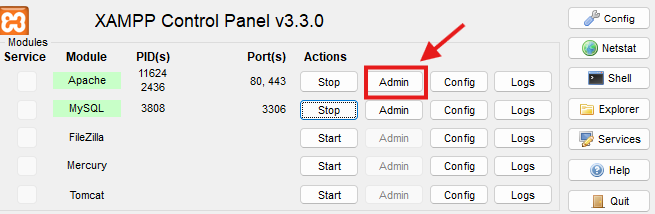

# Loot Box Geek

## Antes de testar:

**Atenção**: Para rodar este sistema, utilize o **XAMPP**.
Você precisará criar o banco de dados utilizado as tabelas e campos correspondentes. Este é um guia para poder rodar nosso sistema. Por padrão, estamos utilizando o Sistema Operacional Windows. Teste este sistema no SO do Windows para poder testar da forma que foi planejada.

---

## Inserir projeto na pasta `htdocs/`

1. Acesse o "`Meu Computador`;
2. Por padrão a pasta `htdocs\` está no caminho: **`C:\xampp\htdocs\`**. Se na sua máquina não estiver neste caminho, você deverá descobrir onde esta página se encontra. Ela é necessária para que possamos rodar nosso sistema no _Apache_ que está dentro do Xampp.
3. Coloque a pasta deste projeto ("lootbox-geek-v2") dentro da pasta `htdocs\`.

### Abrindo o arquivo:

1. Abra o `Xampp Control Panel`;
2. Nas opções `Apache` e `MySQL` que no botão **Start**;

---

## Configurando o banco de dados

Com o `Xampp Control Panel` aberto, clique em `Admin` na opção **`MySQL`**.

Você será direcionado ao PhpMyAdmin - nosso ambiente para rodar nosso banco de dados.

#### Nome do banco de dados: **lootbox_db**

Acessando o "PhpMyAdmin", crie um banco de dados com o nome de `lootbox_db`.

#### Tabela: "user_registration"

Dentro do PhpMyAdmin, no banco de dados criado (lootbox_db), crie a tabela `\_user_registration*` com o seguinte código sql:

```sql
    CREATE TABLE user_registration(
    id_user INT AUTO_INCREMENT PRIMARY KEY,
    username VARCHAR(50) NOT NULL,
    email VARCHAR(100) NOT NULL UNIQUE,
    password_login VARCHAR(255) NOT NULL,
    image_user VARCHAR(255) DEFAULT NULL DEFAULT '../src/img/user/default.jpeg',
    created_at TIMESTAMP DEFAULT CURRENT_TIMESTAMP
);

```

- Esta é a tabela que você vai criar:

| Nome do Campo  |
| -------------- |
| id_user        |
| username       |
| email          |
| password_login |
| image_user     |
| created_at     |

#### Importando outras tabela para o banco de dados

Navegando na pasta: `lootbox-geek-v2/src/`, você encontrará um arquivo chamado **`lootbox_db.sql`**.

Dentro do _PhpMyAdmin_ você deverá importar este arquivo para dentro do banco de dados **lootbox_db**.
Agora você terá tudo para que o sistema rode da forma em que se encontra no último commit.

#### Executando o aquivo

Execute o **apache** dentro do **xampp** para poder simular um servidor e poder rodar nossa aplicação, clicando em "`Admin`" e procurando pelo arquivo que você inseriu dentro da pasta pasta `C:\xampp\htdocs\` de dentro do seu computador.



Agora basta inserir este URL no seu navegador: `http://localhost/lootbox-geek-v2/public/`
